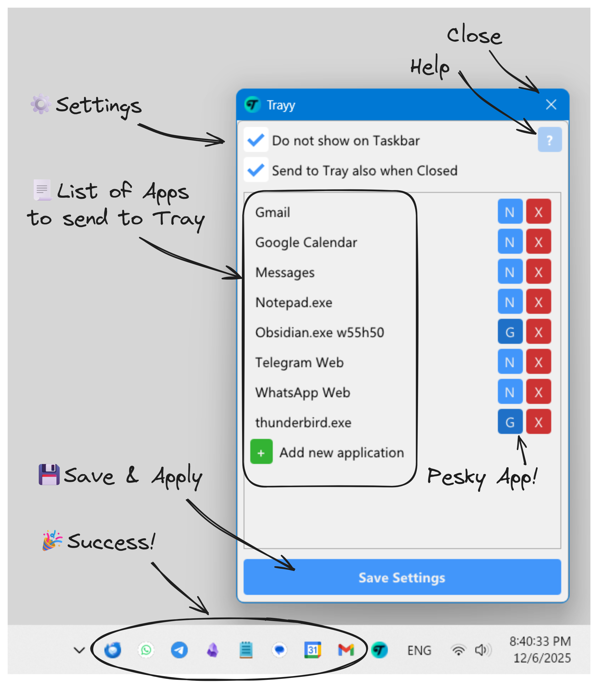
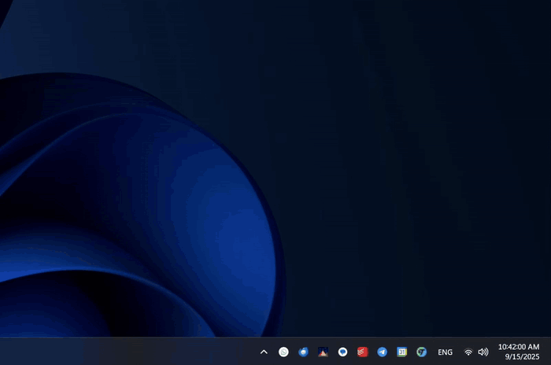
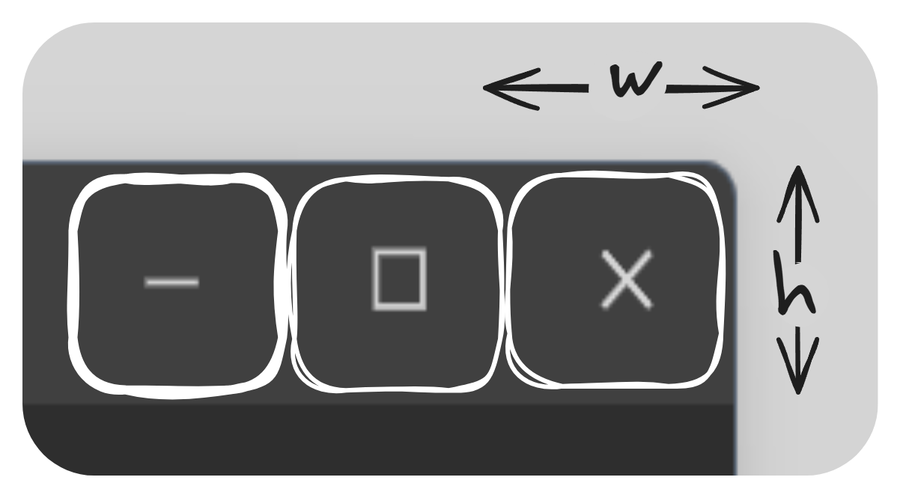

<h1 align="center">
    
    <div>
    Trayy
    </div>
</h1>

<p align="center">
Ever wished you could tell some apps to chill in the system tray? </br>Say hello to Trayy, your desktop's new bouncer!
</br>
</br  >

</p>

## 🎯 Features

-   **Send to Tray**: Send your favorite apps to the system tray for a clutter-free workspace!
-   **Hide and Seek Champion**: Enjoy the power to completely hide apps from the taskbar, keeping your desktop neat and tidy.
-   **App Support**: Ideal for Progressive Web Apps (PWAs) and (most) apps that didn't get the memo about system tray support.
-   **Quick Actions**: Quickly send an application to system tray or toggle always-on-top by right clicking on control buttons.
-   **Compatible with Windows**: Tested on Windows 10 and 11 with support for toast notifications.
-   **Light as a Feather**: Fully portable and extremely lightweight.

<p align="center">
  
  
</p>

## 🚀 Getting Started

1. Kick things off by downloading `Trayy.zip` and unzipping it to your desired location.
2. Make sure `Trayy.exe` and `hook.dll` are hanging out in the same folder. Run the app to get the party started.

<div style="max-width: 600px; margin: auto;">

> **Note on Security**: Your antivirus such as Windows Defender might raise a false positive due to the nature of Trayy and its hook procedure. But fear not! Trayy is harmless and fully open source, so you may inspect it for yourself at any time. ([VirusTotal report](https://www.virustotal.com/gui/file/96ac09b3d788e7b02c1afed4b866511deab00d260704221182137fcb9000b32e?nocache=1))

> **For Gamers**: Be advised, Trayy might trip up some uncool anti-cheat software such as Riot Vanguard!

</div>

3. Time to pick your superpowers:

    - **Do not show on Taskbar**: Your app will become the ultimate hide-and-seek champion, staying off the taskbar completely.
    - **Send to Tray also when Closed**: Even if you hit the X button, your app will just chill in the tray instead of closing.

    Now, list out your favorite apps. Here are the rules:

    - **No extensions** (example `WhatsApp Web`): Trayy will look for browser tab titles that contain your specified string. This is mainly intended for WebApps. Use distinctive keywords to avoid accidental matches!
    - **With extension** (example `Notepad.exe`): Match any process name as seen in Task Manager that matches your entries.

    <div style="max-width: 600px; margin: auto;">

    > **Heads up:** Universal Windows Platform (UWP) apps (like those from the Microsoft Store) like to do their own thing and aren’t supported by Trayy.

    </div>

    Assign the desired capture method:

    - **N** or `Normal`: This mode intercepts the Windows API close commands for efficient handling of clicking the control buttons with a mouse. It won't intercept other closing methods such as keyboard shortcuts.
    - **G** or `Graphical`: For pesky apps that don't use standard window controls (like `Thunderbird` and `Obsidian`), Trayy can use a special detection method by watching clicks on the top‑right of the titlebar so even tricky programs can be tucked away smoothly!

    You can modify your entries with these tricks:

    - If your app has multiple windows, you can optionally control which window to target by adding the desired title name to the process name. For example `thunderbird.exe Write` will capture the email compose window specifically. This is also handy to avoid unwanted capture of hidden windows.
    - For even more control, you can use ECMAScript style regular expressions by prefixing your title entry with `regex:`. For example `Notepad.exe regex:^Daily Notes` will only match the titles starting with 'Daily Notes'.
    - For the Graphical mode, you can optionally modify the control button bounding box by adding the desired size in pixels to your entry like this: `Obsidian.exe w55h50`.

<p align="center">
  
</p>

4. Hit Save and BAM! Depending on your settings, your chosen apps will now be tucked away neatly in the system tray.

Tips and Tricks:

-   Click on a tray icon to bring its app into the spotlight. If it's already in focus, it'll sneak back into the tray. This way, you can quickly peek at your apps without breaking your workflow!
-   Quick Actions:

    -   **Right-click Minimize**: Send the app to tray without adding it to the app list.
    -   **Right-click Close**: Send the app to tray and permanently add it to the app list.
    -   **Right-click Maximize**: Toggle always-on-top. This action will use PowerToys if possible.

-   **AutoHotKey**: If you belong to the elite AHK squad, you can use Trayy to handle your apps:

    To send the active app to tray:

    ```Swift
    DetectHiddenWindows 1
    target := WinExist("A")
    host := WinExist("ahk_exe Trayy.exe")
    PostMessage 0x0402, 0, target, host
    ```

    To restore a specific app from tray:

    ```Swift
    DetectHiddenWindows 1
    target := WinExist("ahk_exe Specific.exe")
    host := WinExist("ahk_exe Trayy.exe")
    PostMessage 0x0405, 0, target, host
    ```

-   **Startup**: Let Trayy join your startup squad! Add Trayy's shortcut to your `shell:startup` folder, along with all your other favorite apps you want to keep tucked away in the system tray. For WebApps, you can ask your browser to add their shortcuts to your Desktop. Then, simply move those shortcuts into the startup folder. Trayy will chill for a bit, letting the startup process finish, then swoop in to tidy everything up! It's a game changer for messaging and productivity apps!

## 😊 Acknowledgements

This project is inspired by RBTray.

If Trayy made your workflow smoother, consider supporting its development! ☕✨

[](https://ko-fi.com/Q5Q21EOKMX)
