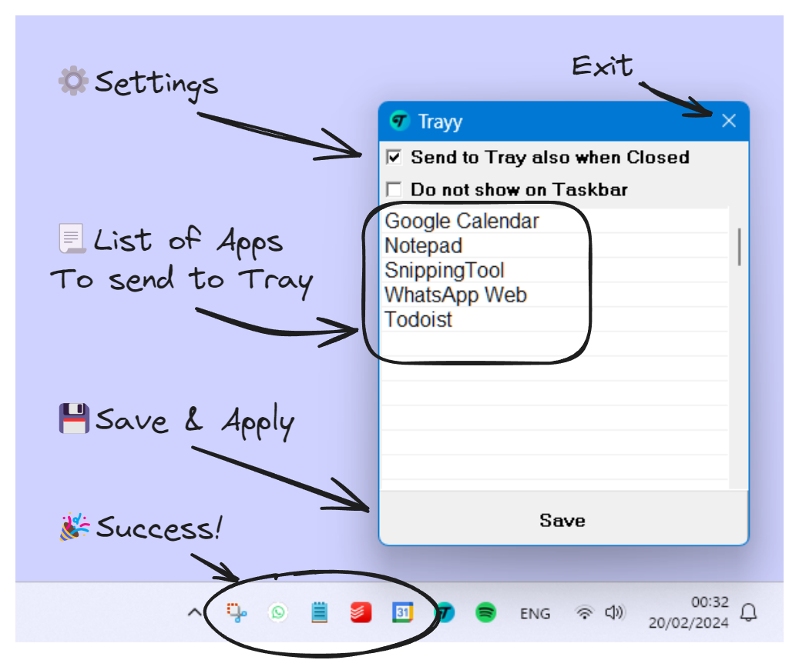

<h1 align="center">
    
    

    Trayy
</h1>

Ever wished you could tell some apps to chill in the system tray?  Say hello to Trayy, your desktop's new bouncer!

## 🎯 Features

- **Send to Tray**: Send your favorite apps to the system tray for a clutter-free workspace!
- **Hide and Seek Champion**: Enjoy the power to completely hide applications from the taskbar, keeping your desktop neat and tidy.
- **App Support**: Ideal for Progressive Web Apps (PWAs) and (most) apps that didn't get the memo about system tray support. 
- **Compatible with Windows**: Works with both Windows 10 and 11... prob works with earlier versions too, but we're not going to talk about that.
- **Light as a Feather**: Portable and lightweight, perfect for those who value efficiency.

## 🚀 Getting Started

1. Kick things off by downloading `Trayy.zip` and unzipping it to reveal the magic inside!
2. Make sure `Trayy.exe` and `hook.dll` are hanging out in the same folder, then run the app to get the party started.
3. Time to pick your superpowers:
   - **Send to Tray also when Closed**: Even if you hit the X button, your app will just chill in the tray.
   - **Do not show on Taskbar**: Your app will become the ultimate hide-and-seek champion, staying off the taskbar completely.
4. Now, list out your favorite applications (case-sensitive). Trayy will keep an eye out for any windows process names that match your list. For WebApps, Trayy will look for tab names that contain your specified string.
5. Hit Save and BAM! Depending on your settings, your chosen applications will now be tucked away neatly in the system tray.
6. Click on a tray icon to bring its application into the spotlight. If it's already in focus, it'll sneak back into the tray. This way, you can quickly peek at your apps without breaking your workflow!

  

**Pro Move**: Let Trayy join your startup squad! Just type `shell:startup` in the File Explorer's address bar to find the startup folder. Add Trayy's shortcut to your startup folder, along with all your other favorite apps you want to keep tucked away in the system tray. For WebApps, you can ask your browser to add their shortcuts to your Desktop. Then, simply move those shortcuts into the startup folder. Trayy will chill for a bit, letting the startup process finish, then swoop in to tidy everything up! It's a game changer for chat and calendar apps!

## 🙏 Acknowledgements

This project is based on RBTray. 
RBTray: https://github.com/benbuck/rbtray
