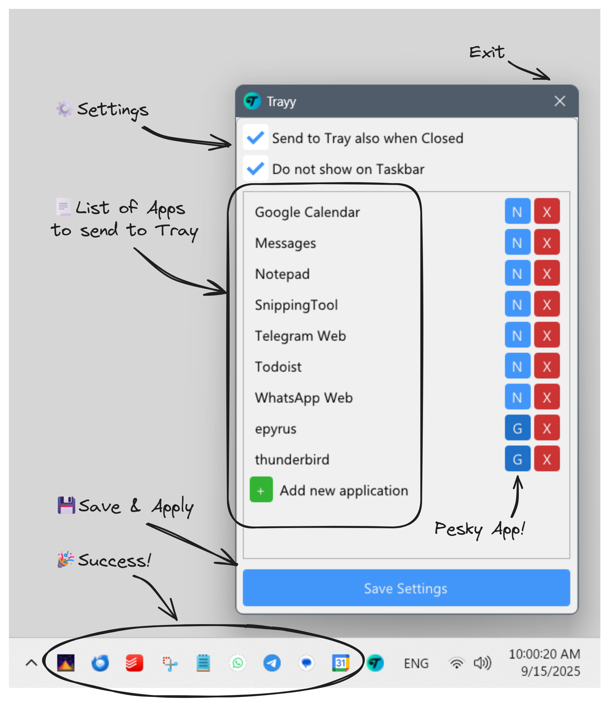

<h1 align="center">
    
    

    Trayy
</h1>

Ever wished you could just tuck away some applications into your system tray instead of cluttering your taskbar?
Well, wish no more! Trayy is here to save your day (and your taskbar space)!

## 🎯 Features

- Send applications of your choice to the system tray upon minimizing and/or closing them
- Perfect for Progressive Web Apps (PWAs) and Apps with no built-in system tray support
- Compatible with Windows 10 and 11
- Portable and lightweight

## 🚀 Getting Started

1. Place `Trayy.exe` and `hook.dll` in the same directory and run the app
2. Specify a list of applications (case sensitive) click "Save"
3. Voila! Depending on your settings, your desired applications will now be sent to the system tray upon minimizing and/or closing them

Hot tip: Add Trayy to your startup folder along with all the other apps you wish to keep running in Tray. Perfect for chat and calendar apps!

  

## 🙏 Acknowledgements

This project is based on RBTray. 
RBTray: https://github.com/benbuck/rbtray
